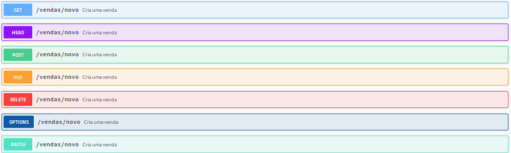

# Как работают HTTP-методы 

Представь, что интернет — это большой ресторан, а сайты — это разные столики, где ты можешь заказать еду. HTTP-методы — это команды, которые ты даёшь официанту, чтобы получить, добавить или изменить что-то на этом столике.

**1.  — "Покажи мне, пожалуйста"**
Это как попросить официанта принести тебе меню или блюдо.
Ты просишь сайт показать какую-то информацию — например, страницу с новостями или фотографиями.
Важно: GET ничего не меняет, только получает информацию.

**2.  — "Я хочу что-то добавить"**

Это как сделать заказ официанту — например, попросить принести тебе новый салат.
Ты отправляешь сайту новые данные — например, регистрируешься или отправляешь сообщение.
Важно: POST создаёт что-то новое.

**3.  — "Обнови это, пожалуйста"**

Это как попросить официанта заменить твой старый заказ на новый — например, поменять салат на суп.
Ты говоришь сайту заменить существующую информацию новыми данными.
Важно: PUT обновляет или заменяет данные.

**4.  — "Убери это"**

Это как попросить официанта убрать блюдо со стола.
Ты говоришь сайту удалить что-то — например, удалить свой аккаунт или комментарий.
Важно: DELETE удаляет информацию.

**5.  — "Исправь немного"**

Это как попросить официанта изменить часть твоего блюда — добавить соус или убрать лук.
Ты говоришь сайту внести небольшие изменения в существующие данные.
Важно: PATCH меняет часть информации.

**6. HEAD — "Покажи мне заголовки, но не тело"**

Это как попросить официанта рассказать, какие блюда есть в меню, но без того, чтобы приносить само меню или еду.
Ты получаешь только информацию о ресурсе (например, дату последнего обновления, размер файла), но не сам контент.
Используется, чтобы быстро проверить, есть ли обновления или доступен ли ресурс, без загрузки всей страницы.

**7. OPTIONS — "Что ты умеешь?"**

Это как спросить у официанта: «Какие блюда сегодня есть?» или «Какие услуги вы предоставляете?»
Сервер отвечает, какие методы он поддерживает для конкретного ресурса — например, может ли он принимать POST, PUT или только GET.
Это помогает клиенту понять, какие действия можно делать с этим ресурсом.

| Метод     |	Что делает	| Пример из жизни |
| --------- | ------------- | --------------- |
| `GET`	    | Запрашивает информацию |	Попросить меню |
| `POST`    | Добавляет что-то новое |	Сделать заказ |
| `PUT`     |	Полностью обновляет информацию |	Заменить заказ |
| `DELETE`  | Удаляет информацию	| Убрать блюдо со стола |
| `PATCH`   | Частично изменяет информацию | Добавить соус к блюду |
| `HEAD`    |	Запрашивает только информацию о ресурсе (заголовки) без содержимого |	Узнать, есть ли блюдо в меню, не заказывая его |
| `OPTIONS`	| Спрашивает, какие действия разрешены |	Узнать, какие услуги доступны в ресторане |

Ниже показан пример из Swagger, где видно все основные HTTP методы:

